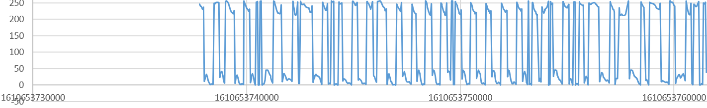
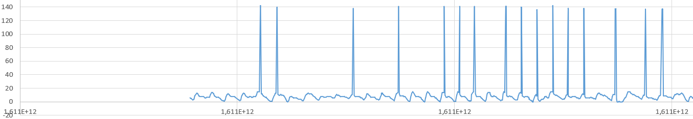
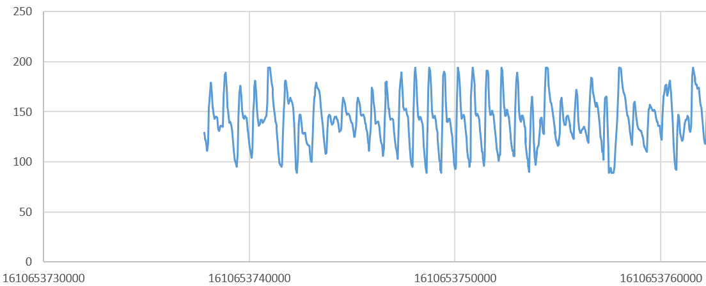
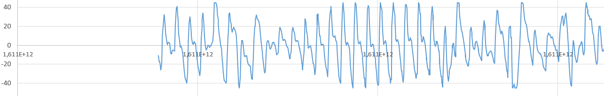
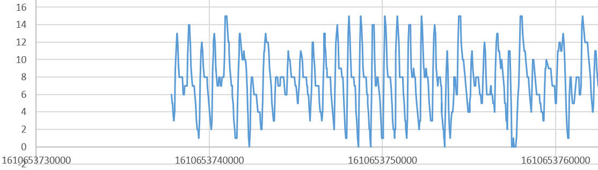

# Ingeniería Inversa sobre un oxímetro BLE de bajo coste

En la actualidad se comercializan Oxímetros pulsímetros a precios muy reducidos con muy buenas prestaciones. Además, disponen de BLE que permiten la extracción de los datos del paciente para la realización de estudios o aplicaciones específicas.

El modelo elegido ha sido el siguiente: <https://es.aliexpress.com/item/4001366397051.html?spm=a2g0s.9042311.0.0.274263c0DHVgga>

O [este otro](https://es.aliexpress.com/item/1005001826892996.html?spm=a2g0o.detail.1000014.47.3ce82abczTKCUw&gps-id=pcDetailBottomMoreOtherSeller&scm=1007.14976.208662.0&scm_id=1007.14976.208662.0&scm-url=1007.14976.208662.0&pvid=5051f94a-c4fe-4a42-88ef-3958e98dfa76&_t=gps-id:pcDetailBottomMoreOtherSeller,scm-url:1007.14976.208662.0,pvid:5051f94a-c4fe-4a42-88ef-3958e98dfa76,tpp_buckets:668%230%23131923%2392_668%23888%233325%2312_4976%230%23208662%2319_4976%232711%237538%23894_4976%233104%239653%235_4976%234052%2318550%231_4976%233141%239887%233_668%232846%238115%232000_668%232717%237558%23158_668%231000022185%231000066058%230_668%233422%2315392%23822_4452%230%23189847%230_4452%233474%2315675%23453_4452%234862%2322449%23779_4452%233098%239599%23360_4452%233564%2316062%23310)

Nota: Para aumentar las probabilidades de éxito se compraron 3 oxímetros diferentes.

En lugar de comprar un dispositivo de bajo coste, también se barajó la posibilidad de construir nuestro propio prototipo. Algunos ejemplos se muestran en [Open Source Pulse Oximeter for COVID-19](https://www.hackster.io/gatoninja236/open-source-pulse-oximeter-for-covid-19-4764c5) o [ATtiny85 Pulse Oximeter and Photoplethysmograph](https://www.hackster.io/jeffreymagee/attiny85-pulse-oximeter-and-photoplethysmograph-e3f907).

La aplicación recomendada por el fabricante es la siguiente:

NarigMed (ver instrucciones)

Se realizó la ingeniería inversa de la apk. Los resultados no fueran muy satisfactorios  

Para tratar de descubrir el protocolo de comunicación se utilizó un escáner de BLE. 

<https://play.google.com/store/apps/details?id=com.macdom.ble.blescanner&hl=es&gl=US>

Como se puede apreciar en el siguiente vídeo, descubrimos que disponía de una característica dentro de uno de sus servicios que al enviar una notificación, comenzaba a mandar datos sin parar.

Nota: Una prueba similar con los otros dos oxímetros comprados, no nos permitió descubrir ningún servicio que enviara datos desde el dispositivo.

Decidimos hacer una app Android que permitiera conectarse al dispositivo y descargar estos datos.

Comenzamos probando el software de ejemplo proporcionado por Google  

[https://github.com/android/connectivity-samples /](https://github.com/android/connectivity-samples%20/) BluetoothLeGatt

Aunque con otros oxímetros la aplicación se conectaba, para el dispositivo seleccionado fue imposible. Desconocemos la razón.

Tras buscar otro software de escáner BLE que permitiera la conexión del dispositivo, encontramos el siguiente:

<https://github.com/Jasonchenlijian/FastBle>

Lo modificamos ligeramente para que la información recibida fuera mostrada por el LogCat. Para esto, se añadió la línea subrayada en el fichero CharacteristicOperationFragment:

@Override
public void onCharacteristicChanged(byte[] data) {
`  `runOnUiThread(new Runnable() {
`    `@Override
`    `public void run() {
`      `addText(txt, HexUtil.*formatHexString*(characteristic.getValue(), true));
`      `**Log.*d*("tag",System.*currentTimeMillis*()+"; " +**
`                   `**HexUtil.*formatHexString*(characteristic.getValue(), true));**
`    `}
`  `});
}

La ejecución del fichero puede verse en el siguiente vídeo.

Poner vídeo

Esta salida se recoge en el siguiente fichero. [Log2 FastBLE FRO200.txt]

Un pequeño extracto se muestra a continuación. Cada línea corresponde con una recepción de datos. A la izquierda se muestra la marca temporal en formato tiempo Unix:

1610653740191; fa 06 80 07 09 96

1610653740236; fa 06 80 13 0b a4 fa 06 80 1b 0c ad

1610653740282; fa 06 80 22 0d b5

1610653740284; fa 06 80 22 0d b5

1610653740326; fa 06 80 19 0c ab

1610653740329; fa 06 80 19 0c ab

1610653740372; fa 06 80 09 09 98

1610653740374; fa 06 80 09 09 98

1610653740415; fa 06 80 00 08 8e

1610653740416; fa 06 80 00 08 8e

1610653740461; fa 06 80 fb 07 88

1610653740463; fa 06 80 fb 07 88

1610653740513; fa 06 80 fd 07 8a

1610653740519; fa 06 80 fd 07 8a

1610653740555; fa 06 80 00 08 8e

1610653740558; fa 06 80 00 08 8e

1610653740604; fa 06 80 00 08 8e fa 06 80 00 08 8e

1610653740644; fa 06 80 fe 07 8b fa 0b 81 5e 53 00 0a 91 18 00 f0

1610653740649; fa 06 80 fe 07 8b fa 0b 81 5e 53 00 0a 91 18 00 f0

1610653740653; fa 0b 81 5e 53 00 0a 91 18 00 f0 

1610653740689; fa 06 80 ff 07 8c

1610653740692; fa 06 80 ff 07 8c

1610653740734; fa 06 80 00 08 8e

1610653740740; fa 06 80 00 08 8e

Un análisis rápido permite extraer las siguientes conclusiones. Se reciben datos aproximadamente cada 25ms. En cada recepción de datos se recibe una o dos tramas. La estructura de trama es la siguiente:

|fa|06|80|07  09  96|
| :-: | :-: | :-: | :-: |
|
valor

fijo
|long. trama|tipo trama|datos|
Solo se recogen dos tipos trama la anterior, siempre de tamaño 6 y la siguiente de tamaño 11:

|fa|0b|81|5e 53 00 0a 91 18 00 f0|
| :-: | :-: | :-: | :-: |
|
valor

fijo
|long. trama|tipo trama|datos|
El significado de cada uno de los datos se explica más adelante.

Para extraer los datos a partir del log anterior se escribió el siguiente script en Python. La salida es un fichero en formato CSV para facilitar su análisis desde una hoja de cálculo.

# Transforma el fchero de log en varios ficheros csv

import re

regex = re.compile(r".\*: (\d\*); ([a-f0-9 ]\*)")

def analyze():

`  `array = []

`  `# Extrae las tramas del fichero de log y las almacena en array

`  `with open('Log2 FastBLE FRO200.txt') as file:

`    `for line in file:

`      `results = regex.match(line)

`      `time = results[1]

`      `rem = results[2]

`      `while len(rem)>0:

`        `length = int(rem[3:5],16)

`        `trama = rem[0:length\*3-1]

`        `rem = rem[length\*3:]

`        `array.append((int(time), trama))

`  `# Crea dos ficheros csv según el tipo de trama

`  `with open('output\_80\_2.csv', "w") as out80,  open("output\_81\_2.csv","w") as out81,  open("output\_other\_2.csv","w") as out\_other:

`    `for item in array:

`      `if(item[1][6:8] == "80"):

`        `out80.write(f"{item[0]},{item[1]},{int(item[1][9:11],16)},{int(item[1][12:14],16)},{int(item[1][15:17],16)}\n")

`      `elif(item[1][6:8] == "81"):

`        `out81.write(f"{item[0]},{item[1]},{int(item[1][9:11],16)},{int(item[1][12:14],16)},{int(item[1][15:17],16)},{int(item[1][18:20],16)},{int(item[1][21:23],16)},{int(item[1][24:26],16)},{int(item[1][27:29],16)},{int(item[1][30:32],16)}\n")

`      `else:

`        `out\_other.write(f"{item[0]},{item[1]}\n")

if \_\_name\_\_ == "\_\_main\_\_":

`  `analyze()

En el primer bucle se obtiene array, con la lista de las tramas. Luego se crean dos ficheros csv, cada uno para cada tipo de trama. En estos ficheros se crea una primera columna para la marca temporal, la segunda columna con toda la trama y finalmente una columna para cada uno de los bytes de datos que contiene la trama (a partir del 4º byte están los datos).

## Análisis del fichero output\_80.csv:
Como se ha descrito la trama 80 está formada por tres bytes

|fa|06|80|byte1  byte2  byte3|
| :-: | :-: | :-: | :-: |
|
valor

fijo
|long. trama|tipo trama|datos|
Cada uno de los tres bytes parece ser un campo de información diferente. La representación de estos bytes en función del tiempo dio las siguientes gráficas:

byte1

byte2

byte3

byte1 parece estar en representación complemento a dos. Byte2 presenta algunos picos que claramente es información anómala. Tras cambiar la representación en byte1 y eliminar valores excesivos en byte2, la representación gráfica es la siguiente;

byte1

byte2

byte3

La siguiente tabla muestra el rango de valores de cada campo:

||**Rango de valores**|**Valores diferentes**|**Representación**|
| :-: | :-: | :-: | :-: |
|**byte1**|[-45,45]|91|Complemento a 2|
|**byte2**|[0,15]|16|Natural|
|**byte3**|[89,194]|106|Natural|

Tras comparar las tres gráficas y las estadísticas anteriores, podemos concluir que la información contenida en los tres campos es la misma. La diferencia está en la codificación y en el rango de valores utilizado. 

## Análisis del fichero output\_81.csv:

Como se ha descrito la trama 81 está formada por ocho bytes

|fa|06|81|byte1  byte2  byte3|
| :-: | :-: | :-: | :-: |
|
valor

fijo
|long. trama|tipo trama|Datos|

|fa|0b|81|5e 53 00 0a 91 18 00 f0|
| :-: | :-: | :-: | :-: |
|
valor

fijo
|long. trama|tipo trama|Datos|

Para descifrar el significado de cada byte se realizó una captura con la aplicación mientras se grababa en vídeo los datos visualizados por el dispositivo. [Link a vídeo]

Cada uno de los tres bytes parece ser un campo de información diferente. La representación de estos bytes en función del tiempo dio las siguientes gráficas:

|fa|0b|81|5e|53 00|0a|91 18|` `00 f0|
| :-: | :-: | :-: | :-: | :-: | :-: | :-: | :-: |
|
valor

fijo
|long. trama|tipo trama|Sp O2 (%)|PR/min|RR/min|PI  (%)|¿?|

**Sp O2 (%)** – Saturación de oxígeno en sangre medida en %. Los valores típicos están en el rango [80,99%]

**PR/min** – Pulsaciones por minuto. Se codifica en dos bytes. Para obtener el valor hay que multiplicar el 2º byte por 256 y sumarle el primero. Valores típicos entre 60 y 100.

**RR/min** – Intervalo RR 

**PI (%)** - El índice de perfusión: es la proporción entre el flujo de sangre no pulsátil y el pulsátil a través del lecho capilar periférico. Se codifica en dos bytes. Para obtener el valor hay que multiplicar el 2º byte por 256 y sumarle el primero y luego dividir ente 1000. Valores observados 7.00% a 14.00%

Referencias: 

[Reverse Engineering A Bluetooth Low Energy Oximeter](https://thejeshgn.com/2020/08/05/reverse-engineering-a-bluetooth-low-energy-oximeter/)

